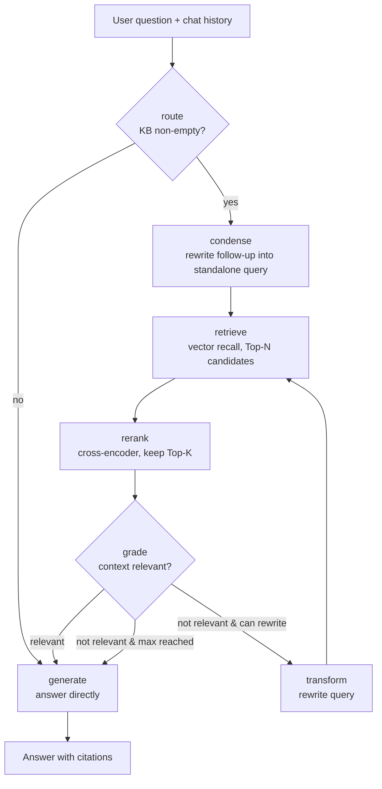

[README.md](https://github.com/user-attachments/files/29246838/README.md)
# 🧠 Local Agentic RAG

**English** | [简体中文](README.zh-CN.md)

> A **fully local** agentic RAG assistant for document Q&A. Retrieval, reranking,
> reasoning and generation all run on your own GPU — no API keys, no data ever
> leaves your machine. Built on **LangGraph**, the agent decides at each step
> whether to retrieve, whether the retrieved context is relevant, and whether to
> rewrite the query — instead of following a fixed pipeline.

<p>
  
  
  
  
</p>

---

## ✨ Highlights

- **Agentic, not vanilla RAG** — a self-correcting loop built with LangGraph: *route → condense → retrieve → rerank → grade → rewrite*.
- **Two-stage retrieval** — fast bi-encoder recall followed by a **cross-encoder reranker**: cast a wide net, then precisely rank, so the LLM sees higher-quality context.
- **Multi-turn memory** — the agent sees the conversation history and rewrites context-dependent follow-ups (e.g. *"what about remote work?"*) into standalone queries before retrieving.
- **100% local** — LLM (Qwen2.5), embeddings (BGE) and the reranker all run on-device; fits in **8 GB of VRAM** with 4-bit quantization.
- **Traceable answers** — responses carry inline citations `[1][2]` and source filenames; the UI shows the exact chunks that were retrieved.
- **Production-minded** — Gradio UI, persistent vector store, an evaluation harness, unit tests and an environment self-check.

## 🏗️ Architecture



| Layer | Component | Role |
|---|---|---|
| Interface | Gradio | Document upload + multi-turn chat + retrieved-context panel |
| Orchestration | LangGraph | State machine: route / condense / retrieve / rerank / grade / transform / generate |
| Generation | Transformers + Qwen2.5-3B (4-bit) | Local LLM inference |
| Reranking | sentence-transformers CrossEncoder + BGE-reranker | Second-stage precision ranking |
| Vector store | ChromaDB | Persistent vector index (cosine) |
| Embeddings | sentence-transformers + BGE | On-device text vectorization |

## 🚀 Quick start

```bash
# 1. Clone and enter
git clone <your-repo-url> && cd local-agentic-rag

# 2. Use an existing conda env, or create one.
#    Verified on Python 3.11 + CUDA 12.x + RTX 4060 (8 GB).

# 3. Install dependencies
pip install -r requirements.txt

# 4. Check your environment (GPU + dependencies)
python scripts/check_env.py

# 5. Launch the app
python app.py
# Open the printed local URL -> upload .pdf/.txt/.md -> click "Index documents" -> ask away
```

On first run, model weights are downloaded automatically from Hugging Face
(Qwen2.5-3B ≈ 6 GB, BGE ≈ 100 MB). Subsequent runs use the local cache.

## 📊 Evaluation

The repo ships with a sample document (`data/sample/handbook.md`) and 6 Q&A pairs:

```bash
python -m eval.evaluate --ingest
```

It prints a keyword-coverage score and the routing decision per question, plus an
average. Swap in your own corpus and question set, and drop a screenshot of the
scores into this README.

### Results & tuning notes

| Stage | Avg. coverage | Notes |
|---|---|---|
| Baseline | **0.167** | The route step let the 3B model decide *whether to retrieve*; it misjudged often, so most queries bypassed the knowledge base. |
| Routing fix | **1.000** | Changed to "always retrieve when the KB is non-empty", delegating quality control to the downstream grade step. |

> This is exactly why the evaluation harness comes first: without a quantitative
> signal, the systematic routing misjudgement would have been invisible.

## ✅ Tests

The pure-logic pieces (chunking, scoring) are unit-tested and need no GPU:

```bash
pip install -r requirements-dev.txt
pytest -q
```

## 🗂️ Project structure

```
local-agentic-rag/
├── app.py                 # Gradio entry point (multi-turn chat + sources panel)
├── config.py              # Central config (overridable via .env)
├── requirements.txt
├── requirements-dev.txt   # Test dependencies
├── src/
│   ├── embeddings.py      # Local BGE embeddings
│   ├── vectorstore.py     # ChromaDB wrapper
│   ├── ingest.py          # Document loading + chunking + indexing
│   ├── reranker.py        # Cross-encoder second-stage reranking
│   ├── llm.py             # Local Qwen2.5 (4-bit, with fp16 fallback)
│   └── agent.py           # ⭐ LangGraph agent orchestration
├── eval/
│   ├── evaluate.py        # Evaluation harness
│   └── questions.jsonl    # Evaluation question set
├── tests/test_core.py     # Unit tests (chunking / scoring)
├── data/sample/           # Sample corpus
└── scripts/check_env.py   # Environment self-check
```

## ⚙️ Configuration

Copy `.env.example` to `.env` and adjust. Common options:

| Variable | Default | Notes |
|---|---|---|
| `LLM_MODEL` | `Qwen/Qwen2.5-3B-Instruct` | Bump to `Qwen2.5-7B-Instruct` if VRAM allows |
| `LOAD_IN_4BIT` | `true` | 4-bit quantization to save VRAM |
| `EMBED_MODEL` | `BAAI/bge-small-zh-v1.5` | Bilingual; swap for `bge-m3` if needed |
| `USE_RERANKER` | `true` | Enable the cross-encoder reranker |
| `RETRIEVE_K` | `12` | Candidate count before reranking |
| `TOP_K` | `4` | Chunks finally passed to the LLM |
| `MAX_REWRITES` | `1` | Max query-rewrite retries |

## 🔧 VRAM & troubleshooting

- **8 GB VRAM** — the default 3B + 4-bit + BGE-small runs comfortably; keep 4-bit on if you switch to 7B.
- **bitsandbytes won't install** — set `LOAD_IN_4BIT=false` for fp16 (3B needs ≈ 6 GB), or reinstall per the official docs.
- **No GPU** — set `DEVICE=cpu` and `LOAD_IN_4BIT=false`; it runs, just slower.
- **Weak retrieval** — raise `TOP_K`, lower `CHUNK_SIZE`, or switch to the stronger `bge-m3`.

## 🧭 Roadmap

- **Hybrid retrieval** — fuse vector search with BM25 keyword search for both semantic and exact matches.
- **Streaming output** — token-by-token responses for a smoother UX.
- **LLM-as-judge evaluation** — grade answers with an LLM instead of keyword matching.
- **FastAPI service** — expose a REST API, decoupling backend from frontend.
- **Docker packaging** — one-command reproducible environment.

## 📄 License

MIT
