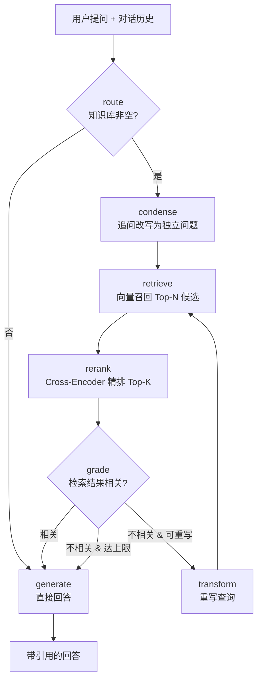

[README.zh-CN.md](https://github.com/user-attachments/files/29246862/README.zh-CN.md)
# 🧠 Local Agentic RAG · 本地智能体检索问答助手

[English](README.md) | **简体中文**

> 一个**完全本地化**的智能文档问答系统:检索、推理、生成全部跑在本地 GPU 上,
> 无需任何 API Key,数据不出本机。基于 **LangGraph** 构建的 agent 会自主决策
> 「是否检索 → 检索结果是否相关 → 是否需要重写查询」,而非固定流水线。

<p>
  
  
  
  
</p>

---

## ✨ 项目亮点

- **Agentic RAG,而非普通 RAG**:用 LangGraph 实现 *路由 → 改写 → 检索 → 重排 → 相关性评分 → 查询重写* 的自我纠错循环。
- **两段式检索**:向量召回(bi-encoder)+ **Cross-Encoder 重排**(reranker),先广撒网再精排,显著提升喂给 LLM 的片段质量。
- **多轮对话记忆**:agent 能看到历史对话,自动把「那远程办公呢?」这类追问改写成独立问题再检索。
- **100% 本地运行**:LLM(Qwen2.5)+ Embedding(BGE)+ Reranker 均在本地 GPU 推理,4-bit 量化下 8GB 显存即可跑通。
- **可溯源**:回答附带引用编号 `[1][2]` 与来源文件名;界面侧栏实时展示「实际检索到的原文片段」。
- **工程完整**:Gradio 界面 + 持久化向量库 + 评测脚本 + 单元测试 + 环境自检。

## 🏗️ 系统架构



| 层 | 组件 | 说明 |
|---|---|---|
| 接口层 | Gradio | 文档上传 + 多轮对话 + 检索来源展示 |
| 编排层 | LangGraph | 状态机:route / condense / retrieve / rerank / grade / transform / generate |
| 生成层 | Transformers + Qwen2.5-3B (4-bit) | 本地 LLM 推理 |
| 重排层 | sentence-transformers CrossEncoder + BGE-reranker | 二段式精排 |
| 向量层 | ChromaDB | 持久化向量索引(cosine) |
| 表示层 | sentence-transformers + BGE | 本地 GPU 文本向量化 |

## 🚀 快速开始

```bash
# 1. 克隆并进入
git clone <your-repo-url> && cd local-agentic-rag

# 2. (推荐)用已有的 conda 环境,或新建一个
#    本项目在 Python 3.11 + CUDA 12.x + RTX 4060 (8GB) 上验证

# 3. 安装依赖
pip install -r requirements.txt

# 4. 自检环境(确认 GPU 与依赖)
python scripts/check_env.py

# 5. 启动应用
python app.py
# 打开终端里的本地链接 → 上传 .pdf/.txt/.md → 点 "Index documents" → 开始提问
```

首次运行会自动从 Hugging Face 下载模型权重(Qwen2.5-3B 约 6GB、BGE 约 100MB),
请耐心等待。之后会走本地缓存。

## 📊 运行评测

仓库自带一份示例文档(`data/sample/handbook.md`)和 6 个问答对:

```bash
python -m eval.evaluate --ingest
```

输出每题的「关键词覆盖率」和路由决策,以及平均分。你可以替换成自己的语料和
问题集,把分数截图放进 README。

### 评测结果与调优记录

| 阶段 | 平均覆盖率 | 说明 |
|---|---|---|
| Baseline | **0.167** | route 让 3B 模型自行判断"是否需要检索",误判率高,多数查询绕过知识库 |
| 修复路由 | **1.000** | 改为"知识库非空即检索",质量把控交给后续 grade 环节 |

> 这一改动说明了为什么要先建立评测:没有量化指标,就发现不了路由环节的
> 系统性误判——而非靠手感猜测。

## ✅ 单元测试

核心纯逻辑(分块、评分)带有测试,无需 GPU 即可运行:

```bash
pip install -r requirements-dev.txt
pytest -q
```

## 🗂️ 项目结构

```
local-agentic-rag/
├── app.py                 # Gradio 入口(多轮对话 + 来源展示)
├── config.py              # 统一配置(支持 .env 覆盖)
├── requirements.txt
├── requirements-dev.txt   # 测试依赖
├── src/
│   ├── embeddings.py      # 本地 BGE 向量化
│   ├── vectorstore.py     # ChromaDB 封装
│   ├── ingest.py          # 文档加载 + 分块 + 入库
│   ├── reranker.py        # Cross-Encoder 二段式精排
│   ├── llm.py             # 本地 Qwen2.5(4-bit/fp16 自动回退)
│   └── agent.py           # ⭐ LangGraph 智能体编排
├── eval/
│   ├── evaluate.py        # 评测脚本
│   └── questions.jsonl    # 评测问题集
├── tests/test_core.py     # 单元测试(分块 / 评分)
├── data/sample/           # 示例语料
└── scripts/check_env.py   # 环境自检
```

## ⚙️ 配置

复制 `.env.example` 为 `.env` 后按需修改。常用项:

| 变量 | 默认 | 说明 |
|---|---|---|
| `LLM_MODEL` | `Qwen/Qwen2.5-3B-Instruct` | 显存够可换 `Qwen2.5-7B-Instruct` |
| `LOAD_IN_4BIT` | `true` | 4-bit 量化,省显存 |
| `EMBED_MODEL` | `BAAI/bge-small-zh-v1.5` | 中英检索,可换 `bge-m3` |
| `USE_RERANKER` | `true` | 是否启用 Cross-Encoder 精排 |
| `RETRIEVE_K` | `12` | 召回候选数(重排前) |
| `TOP_K` | `4` | 最终喂给 LLM 的片段数 |
| `MAX_REWRITES` | `1` | 查询重写最大次数 |

## 🔧 显存与故障排查

- **8GB 显存**:默认 3B + 4-bit + BGE-small,可稳定运行;切 7B 请保持 4-bit。
- **bitsandbytes 装不上**:设 `LOAD_IN_4BIT=false` 走 fp16(3B 约需 6GB),或参考官方文档重装。
- **没有 GPU**:设 `DEVICE=cpu` 且 `LOAD_IN_4BIT=false`,可跑但较慢。
- **检索不准**:调大 `TOP_K`、调小 `CHUNK_SIZE`,或换更强的 `bge-m3`。

## 🧭 Roadmap / 后续规划

- **混合检索**:向量检索 + BM25 关键词检索融合,兼顾语义与精确匹配
- **流式输出**:逐 token 返回,交互更流畅
- **LLM-as-judge 评测**:用大模型给答案打分,替代关键词匹配
- **FastAPI 服务化**:暴露 REST 接口,前后端解耦
- **Docker 打包**:一键复现环境

## 📄 License

MIT
